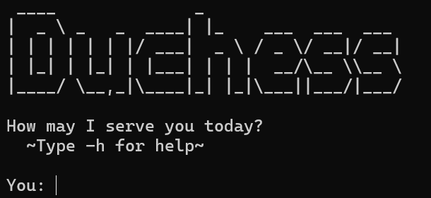

# Duchess User Guide

Welcome to Duchess! Duchess is a desktop app for managing lists and tasks. The chatbot provides a range of commands to help you stay organized.

## Creating a List
The list command lets you create multiple lists\
`list {name}`\
For example:\
`list groceries`\
Expected outcome:\
A list named `"groceries"` will be created.

## Adding tasks
The list command lets you add simple text items. To add a task, use the following format:
`list {name} {item}`\
For example:\
`list groceries Buy_milk`\
Expected outcome:\
The task `"Buy milk"` will be added to your list under the name `"groceries"`.

## Adding todos
The list command lets you add todo items. To add a todo, use the following format:
`list {name} todo {item}`\
For example:\
`list groceries todo Buy_milk`\
Expected outcome:\
The task `"Todo: Buy milk"` will be added to your list under the name `"groceries"`.

## Adding deadlines
The list command lets you manage tasks and their deadlines. To add a deadline, use the following format:\
`list {name} deadline {item} by {deadline}`\
For example:\
`list groceries deadline Buy milk by 2025-03-10`\
Expected outcome:\
The task `"Buy milk"` will be added to your list under the name `"groceries"` with a deadline of `March 10, 2025`.

## Adding events
The list command lets you add events with a start and end time. To add an event, use the following format:
`list {name} event {item} from {start} to {end}`\
For example:\
`list groceries event Buy_milk from 2025-03-10 10:00 to 2025-03-10 11:00`\
Expected outcome:\
The task `"Buy milk"` will be added to your list under the name `"groceries"` with a start time of 
`March 10, 2025 10:00` and an end time of `March 10, 2025 11:00`.

## Ticking or unticking items
The list command lets you mark tasks as done or undone. To tick or untick an item, use the following format:
`list {name} tick {item}`\
`list {name} untick {item}`\
For example:\
`list groceries tick Buy_milk`\
Expected outcome:\
The task `"Buy milk"` will be marked as done.

## Deleting items
The list command lets you delete items from your list. To delete an item, use the following format:
`list {name} delete {item}`\
For example:\
`list groceries delete Buy_milk`\
Expected outcome:\
The task `"Buy milk"` will be removed from your list.

## Listing items
The list command lets you view all items in your list. To list all items, use the following format:
`list {name}`\
For example:\
`list groceries`\
Expected outcome:\
All items in the list `"groceries"` will be displayed.

## Searching for items
The list command lets you search for items in your list. To search for an item, use the following format:
`list {name} search {keyword}`\
For example:\
`list groceries search milk`\
Expected outcome:\
All items in the list `"groceries"` containing the keyword `"milk"` will be displayed.

## Help
The help command lets you view all available commands. To view all commands, use the following format:
`-h`\
Expected outcome:\
All available commands will be displayed.

## Troubleshooting
If you encounter an unrecognized command or a syntax error, Duchess will respond with one of the following:

`"I'm sorry dear, I didn't quite catch that..."`\
`"You'll have to speak up darling, I'm a little hard of hearing..."`\
`"Sorry, I must say I don't quite understand..."`\
These are just a few responses you'll receive if Duchess doesn't understand your input. 
Simply rephrase or check the command format.\
Enjoy using Duchess to stay organized!